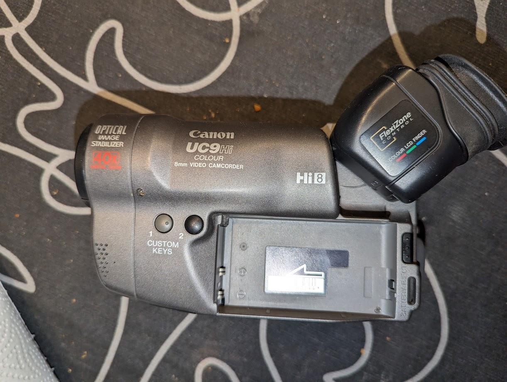
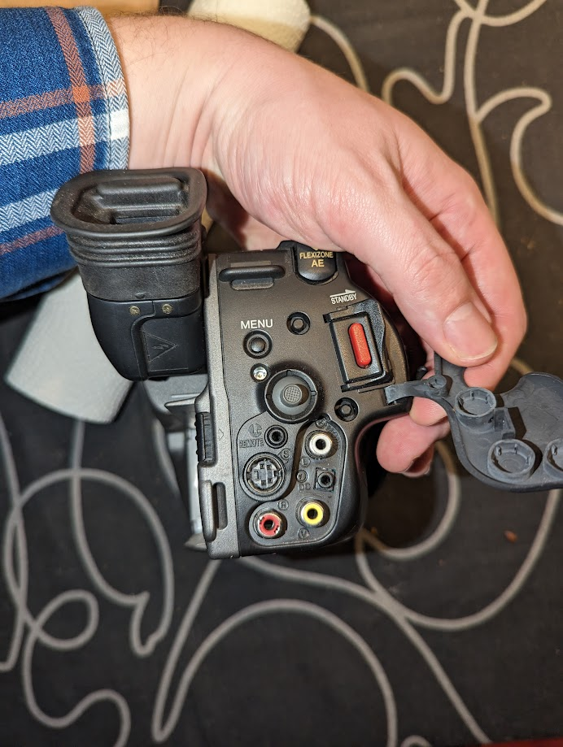

# Hi8 video tapes

<https://en.wikipedia.org/wiki/8_mm_video_format#Hi8>

overzicht van de verschillende van de state of the art technieken om hi8 tapes te digitaliseren:
<https://www.reddit.com/r/DataHoarder/comments/j4rwk1/the_how_do_i_digitizetransfercapture_video_tapes/>

2kliksphilip heeft een video gemaakt over het digitaliseren van VHS tapes. hier kan je voornalijk een goede mindset zien voor het digitaliseren van tapes. ook geeft hij ee overzicht van zijn process.
<https://www.youtube.com/watch?v=_f-foTlhhFY>

## cam corder

we hebben de originele camcorder nog dus misschien kan die nog gebruikt worden om de tapes te digitaliseren.

Canon UC9HI

## andere camcorder met TBC

TBC staat voor Time Base Corrector. Dit is een apparaat dat de timing van het videosignaal corrigeert. Dit is nodig omdat de timing van de video signalen van de verschillende apparaten niet altijd hetzelfde is. Dit kan leiden tot een onstabiel en warped beeld.

<https://www.digitalfaq.com/forum/video-capture/10257-video8-hi8-digital8.html>

Digitalfaq heeft een lijst van camcorders die een TBC hebben.

## capture device

I-O Data GV-USB2??
<https://www.amazon.com/DATA-connection-video-capture-GV-USB2/dp/B00428BF1Y>

## vhs decode

vhs decode is a tool that captures the raw hf signal from debug pins on the vhs player.
it then uses a software decoder to decode the signal to a digital format.

<https://github.com/oyvindln/vhs-decode>

<https://github.com/oyvindln/vhs-decode/wiki/004-The-Tap-List#hi8> and <https://github.com/oyvindln/vhs-decode/wiki/Sony-8mm-Formats>
the above links states that some of the Sony hi8 camcorders have a debug port that can be used to capture the raw hf signal.

a practical example of vhs decode for VHS tapes can be found here:
<https://www.youtube.com/watch?v=pEzmbw_Y-Tw>
